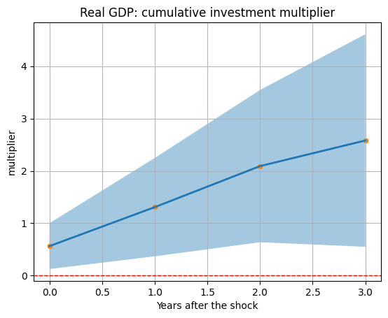
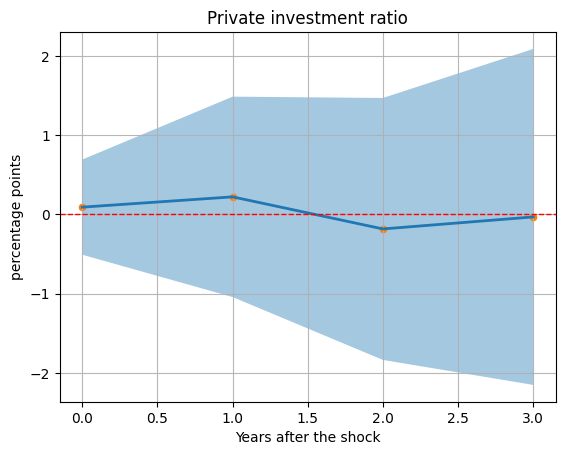
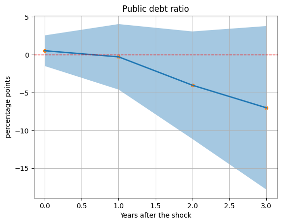
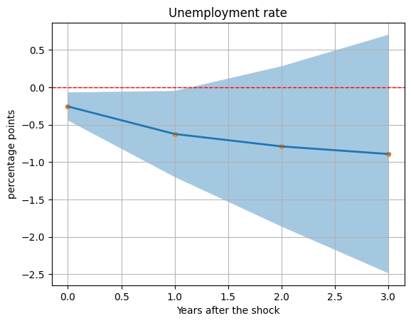

# Public Investment Effects sulle principali variabili macroeconomiche. 
### Modello base dal paper "Boosting the economy without raising the public debt ratio? The effects of public investment shocks in the European Union (Philipp Heimberger and Cara Dabrowski)"

### Modello "Paesi Periferici"
#### Paesi in analisi: Italy, Spain, Portugal, Greece, Cyprus, Malta

