title: "Public Investment Multipliers and Corruption: Does Institutional Quality Matter?"
subtitle: "Replication and Extension of Heimberger & Dabrowski (2025)"
author: "Nome Cognome"
date: "2026-XX-XX"


> *This article combines replication and methodological extension.  
> First, I replicate recent evidence on public investment multipliers in the EU.  
> Second, I ask whether the effectiveness of public investment depends on institutional quality, proxied by corruption.*


### 1. Motivation

In recent years, public investment has returned to the centre of the European policy debate. The need to close infrastructure gaps, support the green transition, and strengthen long-run growth has renewed interest in the macroeconomic effects of public investment, both among policymakers and in the academic literature.

A recent contribution by Heimberger and Dabrowski (2025) provides compelling evidence that public investment shocks boost output, reduce unemployment, and do not endanger public debt sustainability in the European Union. Their results are based on a transparent identification strategy and a modern local projection framework, and they contribute to a growing consensus that public investment may play a central role in stabilisation and growth policies.

At the same time, an important question remains largely unexplored. While average effects are informative, they may conceal substantial heterogeneity across countries. In particular, it is not obvious that public investment should be equally effective in all institutional environments.

This article therefore asks whether the macroeconomic impact of public investment differs systematically between countries with low and high levels of corruption.


### 2. The Original Paper: Idea and Identification Strategy

#### 2.1 Public Investment Shocks via Forecast Errors

The key idea in Heimberger and Dabrowski (2025) is to identify public investment shocks using forecast errors, defined as the difference between realised public investment and the corresponding ex-ante forecast.

```math
F_{i,t} = I^{\text{actual}}_{i,t} - I^{\text{forecast}}_{i,t}
```

Public investment is measured as general government gross fixed capital formation as a share of GDP. This identification strategy addresses two well-known challenges in the empirical analysis of fiscal policy. First, it mitigates the fiscal foresight problem, as economic agents may adjust their behaviour in anticipation of announced investment plans. Second, it alleviates concerns about endogeneity, since forecast errors are plausibly orthogonal to contemporaneous macroeconomic shocks.

By exploiting archive data from European Commission forecasts, the authors align the econometric information set with that of households and firms, strengthening the causal interpretation of the estimated impulse responses.


#### 2.2 Econometric Framework

The dynamic effects of public investment shocks are estimated using local projections following Jordà (2005). At each horizon \(k\), the baseline specification takes the form:

```math
y_{i,t+k} - y_{i,t-1}
=
\beta_k F_{i,t}
+ \sum_j \gamma_{k,j} Z_{i,t-j}
+ \delta_i^k
+ \theta_t^k
+ \varepsilon_{i,t}^k
```

The dependent variable captures the cumulative response of the outcome of interest, which includes real GDP, unemployment, private investment, and the public-debt-to-GDP ratio. The vector of controls accounts for standard macroeconomic dynamics, while country and time fixed effects absorb unobserved heterogeneity. Inference is conducted using Driscoll–Kraay standard errors to account for serial and cross-sectional dependence.

The original paper finds cumulative output multipliers above one, no evidence of crowding-out of private investment, and no deterioration in public debt dynamics.


### 3. Replication: Why It Matters

Before extending the analysis, I replicate the original results using the same empirical framework. Replication serves a dual purpose. First, it provides a validation of the original findings. Second, it establishes a clean benchmark against which the extended specification can be evaluated.

The replicated impulse-response functions closely match those reported in the original study, both in terms of magnitude and dynamic patterns, lending confidence to the subsequent analysis.


### 4. Baseline Results: Interpretation and Economic Context

This section briefly discusses the baseline results obtained from the replication, which form the empirical reference point for the analysis of institutional heterogeneity.


#### 4.1 Real GDP: Cumulative Investment Multiplier

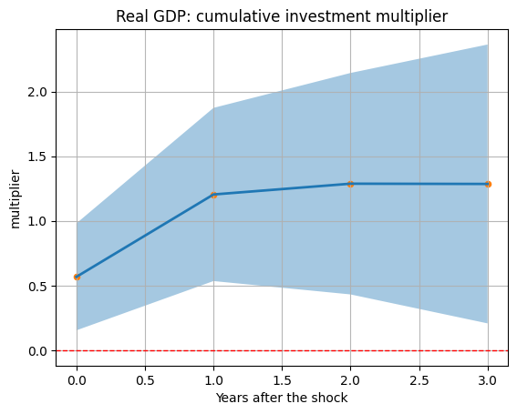

The response of real GDP to a public investment shock exhibits a clear and economically meaningful pattern. On impact, the output multiplier is approximately 0.6, indicating that public investment generates a sizable increase in economic activity, though not a one-to-one effect in the very short run. Over time, the multiplier rises steadily, exceeding unity after one year and stabilising around 1.2 to 1.3 after two to three years.

This gradual build-up is consistent with the idea that public investment operates through both demand-side channels in the short run and supply-side channels in the medium run, as improved infrastructure and public capital enhance productive capacity. The magnitude and persistence of the estimated multipliers are fully in line with the existing empirical literature on public investment.


#### 4.2 Private Investment: Complementarity Rather Than Crowding-Out

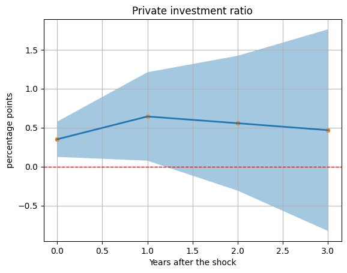

Private investment responds positively to public investment shocks. The response peaks after one year and remains positive over the entire horizon, although uncertainty increases at longer horizons.

These dynamics suggest that public investment does not crowd out private capital formation. On the contrary, they are consistent with a crowding-in mechanism, whereby public investment raises the expected profitability of private projects, improves infrastructure, or reduces adjustment costs faced by firms.


#### 4.3 Public Debt: Debt Dynamics Remain Benign

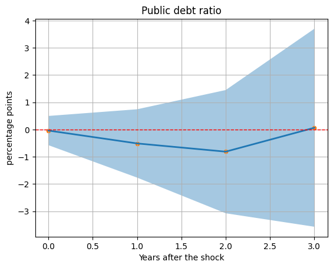

The response of the public-debt-to-GDP ratio is mildly negative in the first two years following the shock and returns close to zero thereafter. While the confidence bands are wide, there is no indication of a systematic increase in public debt.

This pattern suggests that the growth effects of public investment are sufficiently strong to offset its fiscal cost, at least over the medium run. In this sense, public investment appears broadly consistent with debt sustainability.


#### 4.4 Unemployment: Short-Run Labour Market Effects

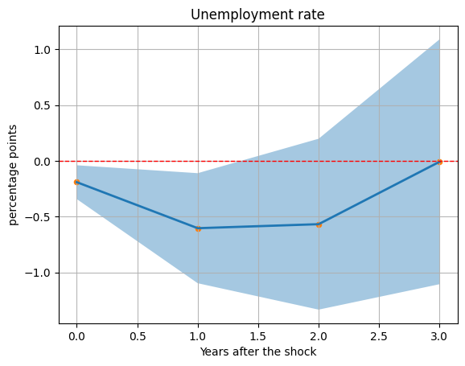

Unemployment declines following the public investment shock, reaching its maximum reduction after one to two years before gradually returning towards its pre-shock level. This response mirrors the dynamics of output and reflects higher labour demand as economic activity expands.

Although uncertainty increases at longer horizons, the short-run decline in unemployment is economically meaningful and reinforces the stabilising role of public investment.


#### 4.5 Summary of Baseline Findings

Taken together, the baseline results depict a coherent macroeconomic adjustment. Public investment raises output by more than one-for-one in the medium run, stimulates private investment, reduces unemployment, and does not lead to an increase in public debt. These findings confirm the effectiveness of public investment on average and provide a solid benchmark for the analysis of heterogeneity across institutional environments.


### 5. Research Question: Does Corruption Matter?

While the average effects of public investment are clearly positive, they may conceal substantial variation across countries. A natural candidate driving such heterogeneity is institutional quality, and in particular corruption.

Higher corruption may reduce the efficiency of public investment, increase leakages and rent-seeking, and weaken the transmission from public spending to real economic activity. This consideration motivates the central question of the article: whether the macroeconomic impact of public investment is systematically lower in more corrupt countries.

#### Evidence from the Literature on Corruption and Economic Activity

A large body of economic research has established that corruption is not merely a legal or ethical issue but also a significant economic phenomenon. In theoretical terms, corruption distorts incentives, generates inefficiencies in public resource allocation, and can undermine the effectiveness of government policies when public officials divert public power for private gain. This broad perspective is supported by principal–agent models, which emphasize how asymmetric information and weak accountability foster rent-seeking and erode economic performance over time. :contentReference[oaicite:0]{index=0}

Empirical studies have documented a robust negative relationship between corruption and key economic outcomes. For instance, cross-country evidence suggests that higher corruption is associated with lower long-run economic growth and reduced private investment, as firms face higher costs, greater uncertainty, and weaker rule of law. Quantitative research has also highlighted how increases in corruption indices correlate with lower GDP per capita growth rates and diminished foreign direct investment. :contentReference[oaicite:1]{index=1}

This literature motivates the inclusion of institutional quality — and in particular corruption — as a potential source of heterogeneity in the transmission of public investment shocks.

#### Data on Corruption: Worldwide Governance Indicators

To measure institutional quality, this study draws on the **Worldwide Governance Indicators (WGI)** produced by the **World Bank Group**. The WGI are a widely used global dataset covering over 200 economies annually since 1996, summarising multiple sources of perceptions about governance into six composite indicators. One of these dimensions, **Control of Corruption**, captures the extent to which public power is exercised for private gain, including petty and grand forms of corruption as well as state capture by elites and private interests. :contentReference[oaicite:2]{index=2}

The Control of Corruption indicator is expressed both as an estimate on a standard normal scale and as a percentile rank relative to all countries. Lower scores and lower percentile ranks reflect worse governance outcomes — that is, more pervasive corruption and weaker institutional controls. :contentReference[oaicite:3]{index=3}

For the heterogeneity analysis in this article, we focus on a subset of 15 countries with the lowest Control of Corruption scores among those in the European Union and selected advanced economies. These countries exhibit comparatively weak governance outcomes, as reflected in the WGI data, and provide an ex-ante basis for assessing whether institutional quality conditions the effectiveness of public investment shocks.

The choice of this subgroup aligns with existing work showing that institutional quality can shape macroeconomic dynamics: countries with weaker control of corruption tend to face higher risks of resource misallocation, lower levels of productive investment, and slower adjustment to shocks. By contrasting impulse responses across this subset and the broader panel, the analysis sheds light on the role of corruption as a modifier of fiscal multipliers.

### 6. Methodological Extension: Introducing Corruption Interactions

#### 6.1 Extended Specification

To address this question, I extend the baseline local projection framework by allowing the public investment shock to interact with lagged corruption.

```math
y_{i,t+k} - y_{i,t-1}
=
\beta_k F_{i,t}
+ \theta_k \left( F_{i,t} \times \text{Corr}_{i,t-1} \right)
+ \sum_j \gamma_{k,j} Z_{i,t-j}
+ \delta_i^k
+ \theta_t^k
+ \varepsilon_{i,t}^k
```

The corruption indicator is lagged and mean-centered, so that \(\beta_k\) captures the effect of public investment at average corruption levels, while \(\theta_k\) measures how this effect varies with institutional quality.


#### 6.2 Interpretation

This specification allows the investment multiplier to vary continuously with corruption. Conditional impulse responses can therefore be computed for countries with different levels of institutional quality, making it possible to assess whether corruption systematically attenuates the effectiveness of public investment.

### 7. Extended Results: High- vs Low-Corruption Countries

This section presents the results of the extended specification, which allows the effects of public investment shocks to differ systematically between countries with high and low levels of corruption. Countries classified as high corruption include Italy, Spain, Portugal, Greece, Cyprus, Malta, Romania, Bulgaria, Croatia, Hungary, Slovakia, Poland, Czechia, Slovenia, and Latvia. The remaining countries in the sample form the low-corruption group.

The comparison reveals pronounced differences in the transmission of public investment shocks across institutional environments.

#### 7.1 Output Effects

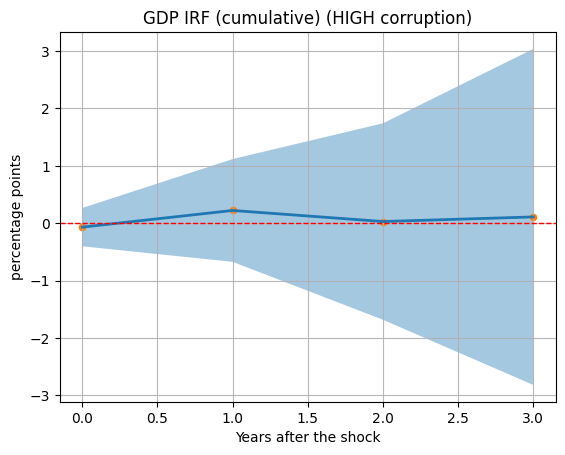
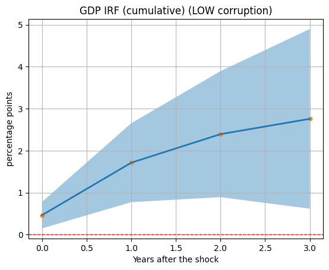

In countries with high levels of corruption, the cumulative response of real GDP to a public investment shock is weak and statistically imprecise. The point estimates remain close to zero throughout the horizon, and the confidence bands widen substantially over time. This pattern suggests that public investment fails to generate sustained output gains in more corrupt environments.

By contrast, in low-corruption countries, public investment shocks lead to large and persistent increases in output. The cumulative multiplier exceeds one already after the first year and continues to rise thereafter, reaching values well above those observed in the baseline. These results indicate that institutional quality plays a crucial role in translating public investment into real economic activity.

#### 7.2 Private Investment Responses

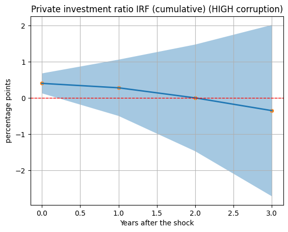
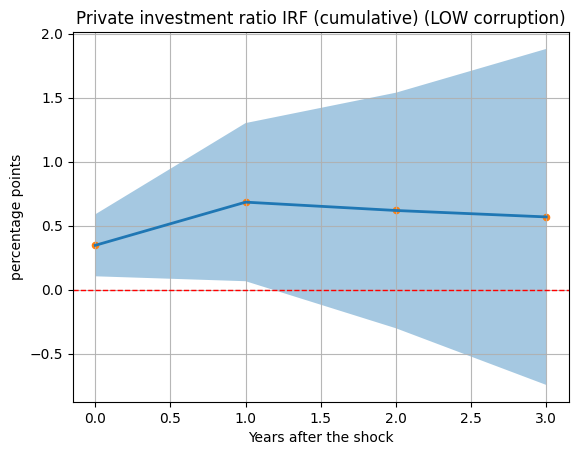

Differences across corruption levels are even more pronounced for private investment. In high-corruption countries, private investment initially reacts weakly and eventually turns negative at medium horizons. This pattern is consistent with crowding-out mechanisms, whereby inefficiencies, rent-seeking, and uncertainty discourage private capital formation.

In low-corruption countries, by contrast, private investment responds positively and persistently. Public investment appears to crowd in private investment, supporting the view that effective institutions enhance complementarities between public and private capital.

#### 7.3 Public Investment Dynamics

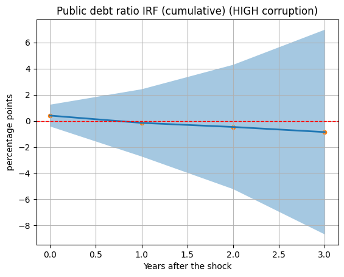
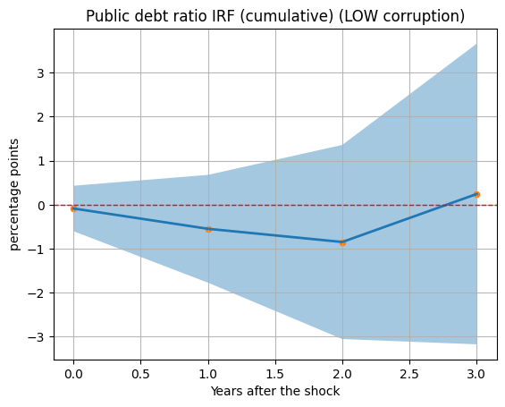

Interestingly, public investment itself increases more strongly in high-corruption countries. This suggests that the weaker macroeconomic effects observed in these countries are not driven by a lack of fiscal impulse. Rather, they point to inefficiencies in the allocation and effectiveness of public investment spending.

In low-corruption countries, public investment also rises, but its macroeconomic impact is considerably larger, reinforcing the interpretation that institutional quality governs the productivity of public capital.

#### 7.4 Labour Market Effects

| Unemployment – High corruption | Unemployment – Low corruption |
| - | - |
| 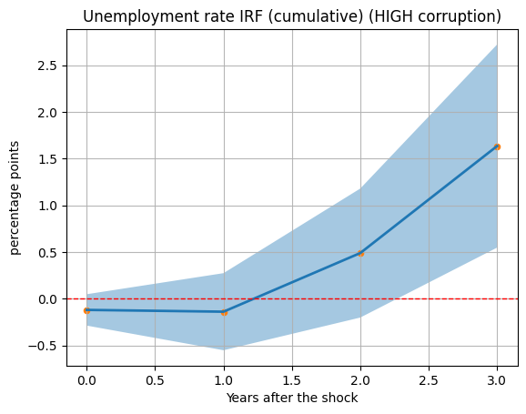 | 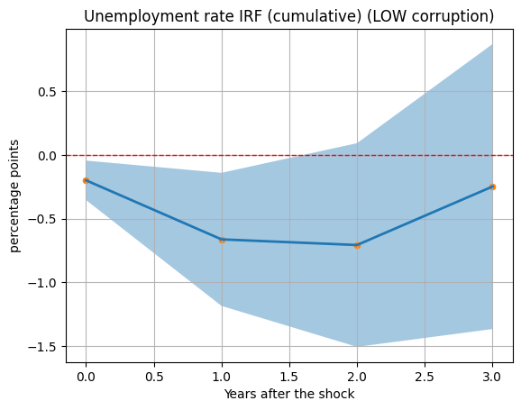 |


The labour market responses further highlight the importance of institutional quality. In high-corruption countries, unemployment declines only briefly and subsequently increases at medium horizons, suggesting that public investment fails to generate durable employment gains.

In low-corruption countries, unemployment falls more sharply and remains below its pre-shock level for a longer period. This pattern mirrors the stronger output response and indicates that public investment translates more effectively into job creation when governance is stronger.

#### 7.5 Interpretation

Taken together, the extended results provide strong evidence that corruption significantly weakens the transmission of public investment shocks. While high-corruption countries experience increases in public investment spending, these do not translate into sustained output growth, private investment, or employment gains.

By contrast, in low-corruption countries, public investment is highly effective, generating large output multipliers, crowding in private investment, and reducing unemployment. These findings suggest that institutional quality is a key conditioning factor for fiscal multipliers and help reconcile heterogeneous results in the empirical literature on public investment.


### 8. Conclusion

This article shows that public investment is highly effective on average, but its macroeconomic impact may depend crucially on institutional quality. Understanding this heterogeneity is essential for the design of public investment strategies that maximise growth and employment gains, particularly in the context of large-scale investment programmes in the European Union.


### References

Heimberger, P., & Dabrowski, C. (2025). *Boosting the economy without raising the public debt ratio? The effects of public investment shocks in the European Union*. Applied Economics Letters.

Jordà, Ò. (2005). Estimation and inference of impulse responses by local projections. *American Economic Review*.

World Bank - Corruption data: https://datacatalog.worldbank.org/search/dataset/0038026/worldwide-governance-indicators?

